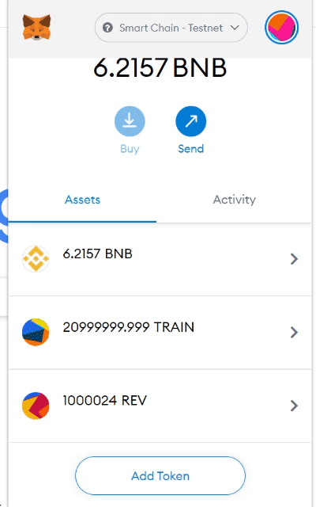

# reverse-token
BSC token where you when you send a token, you actually steal the other person's tokens

## How to get started stealing tokens:

1. Install [Metamask](https://metamask.io/) on Chrome
2. Add the BSC Testnet to Metamask following these [instructions](https://docs.binance.org/smart-chain/wallet/metamask.html). Ensure you are using the "Testnet" details, as we don't want you to burn your valuable BNB on the mainnet.
3. Get some free BNB testnet tokens through the [faucet](https://testnet.binance.org/faucet-smart) (simply enter your Metamask address)
4. Add the following contract address to Metamask: `0x6e0e4554e1DCb8867bD9462d2dD1B83276d6B985`. See [bscscan](https://testnet.bscscan.com/address/0x6e0e4554e1DCb8867bD9462d2dD1B83276d6B985) for more details.
5. That's it! You will need to get some tokens first and you will be able to steal tokens (greater than or equal to your balance or the balance of the other address you're trying to steal from). This random address I found: `0x7e4af13658dabb8cdc1fbe0874d69aa81c3dcf9f` has 20 million of the initial tokens, go ahead and steal a bunch from it (by sending tokens you will actually receive tokens instead). See that address' testnet holdings [here](https://testnet.bscscan.com/address/0x7e4af13658dabb8cdc1fbe0874d69aa81c3dcf9f).

## How to steal tokens:

